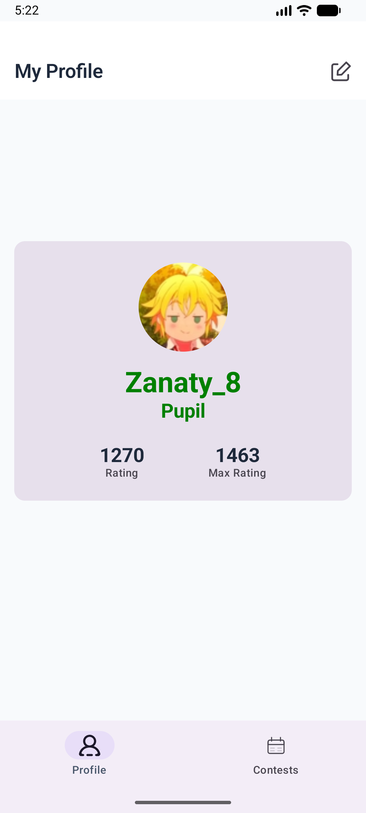
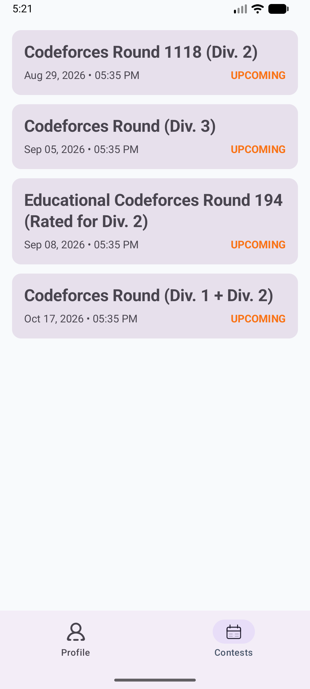

# ⚡ ZCPC

A modern Android companion app for competitive programmers. Currently supporting **Codeforces**, this app allows you to track your profile stats, view your rating, and seamlessly browse and register for upcoming contests.

Built entirely with modern Android development best practices, including **Jetpack Compose** and **Clean Architecture**.

## ✨ Features

- **Personalized Dashboard:** Enter your Codeforces handle once (persisted via DataStore) to instantly load your profile on every launch.
- **Offline-First Caching:** Profile data is aggressively cached using Room, meaning your stats are available even without an internet connection.
- **Live Contest Schedule:** Fetches upcoming and currently running contests.
- **One-Tap Registration:** Tap any contest to securely open the Codeforces registration page via Chrome Custom Tabs—without losing your active browser session.

## 🛠️ Tech Stack & Architecture

This project strictly follows the **Clean Architecture** pattern (Data ↔ Domain ↔ Presentation) using a unidirectional data flow (MVI-inspired).

- **UI:** Jetpack Compose, Material Design 3, Type-Safe Navigation Compose
- **Architecture:** Clean Architecture, ViewModel, StateFlow
- **Dependency Injection:** Dagger Hilt
- **Network:** Retrofit, OkHttp, Kotlinx Serialization
- **Local Storage:** Room Database, Preferences DataStore
- **Async/Threading:** Kotlin Coroutines & Flow
- **Image Loading:** Coil
- **Web Integration:** AndroidX Browser (Chrome Custom Tabs)

## 📸 Screenshots
<p align="center">
  
  
</p>

## 🚀 How to Run

1. Clone the repository:
   ```bash
   git clone [https://github.com/Mohamed8Zanaty/ZCPC.git](https://github.com/Mohamed8Zanaty/ZCPC.git)
2. Or you can just install it :)
